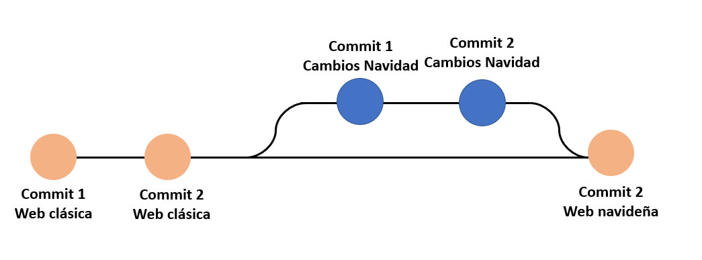

# GIT Y GITHUB

Git es el sistema más famoso y poderoso de control de versiones. Creado por Linus Torvalds.

## Iniciar un repositorio

Para iniciar un repositorio de Git, debemos abrir una terminal o línea de comandos en la ruta de la carpeta a la que deseamos gestionar sus versiones y colocar el siguiente comando:

> git init

Esto creará una carpeta **.git**, la cual contenerá las configuraciones necesarias para manejar el repositorio.

## Ciclo de vida o estados en los archivos de Git

Los archivos de una directorio que contenga la carpeta **.git** pueden tener 4 estados distintos:

- Achivos Tracked: Archivos que pertenecen al repositorio cuya última versión fue guardada por medio de un commit.

- Archivos Staged: Archivos que están registrados en Git a la espera de ser guardados definitivamente en el repositorio.

- Archivos Unstaged: Archivos que están siendo trackeados por Git, pero cuyas últimas modificaciones solo están en el disco duro, pues no han pasado al estado de staging.

- Archivos Untracked: Archivos que solo viven en el disco duro y no son trackeados por Git.

### Comandos Importantes

- **git status**: Nos permite ver el estado de todos nuestros archivos y carpetas.
- **git add**: Conviente archivos Untracked y Unstaged a Staged.

  > git add \<filename\> **(Un solo archivo)**

  > git add . **(Todos los archivos)**

- **git reset HEAD**: Nos ayuda a devolver los archivos que se encuentren en el estado Staged a su estado estado anterior.
- **git commit**: Permite convertir archivos staged a tracked. Al ejecutar este comando se nos solicitará un mensaje a ser guardado en el repositorio, para futuras consultas.

  > git commit -m "mensaje interesante"

  > git commit -am "mensaje interesante"

  <small>Psdt: El comando **git commit -am** solo aplicará para archivos unstaged. No tendrá efecto en archivos untracked.</small>

- **git rm**: Este comando tiene dos formas de funcionar.

  > git rm --cached \<filename\> > <small>Mueve los archivos que se le indique al estado untracked</small>

  > git rm --force \<filename\> > <small>Elimina los archivos de Git y del disco duro. Es posible luego recuperarlos, pero se deben utilizar comando más avanzados. Utilízalo con precaución.</small>

- **git log**: Sirve para mostrar todos los commits de una rama.

  > git log

  > git log --oneline

  > git log --all --graph --decorate --oneline

## Analizar cambios en el repositorio

El propósito de contar con un sistema de control de versiones es el poder de regresar en el tiempo, si algo se rompió, ver qu;e cambió para romper el código y así hacer los cambios necesarios.

Git cuenta con varias maneras de revisar los cambios en un documento:

> git show \<filename\>

<small>Muestra los útlimos cambios de un archivo</small>

Si deseáramos ver las diferencias entre un commit y otro, podemos usar el comando **git diff**

> git diff \<commitID1\> \<commitID2\>

## "Volver en el tiempo" con Git

En git tenemos más de una forma para regresar en el tiempo y estas se diferencian por la "rudeza" de la acción.

**git checkout**: Nos permite volver atrás a un commit específico, pero también regresar al HEAD, no elimina nada, solo oculta o muestra según el commit al que se viaje.

> git checkout \<commitID\>

**git reset**: Con este comando no solo volvemos en el tiempo, sino que también borramos los cambios que hicimos después del commit indicado. Este commando tiene dos versiones:

> git reset --soft \<commitID\>

<small>Borra los commits posteriores al indicado, pero mantiene los archivos que fueron puesto en el área de staging, tal como estaban.</small>

> git reset --hard \<commitID\>

<small>Borra los commits posteriores al indicado y toda la información en staging.</small>

## Ramas o Branches

Una de las funcionalidades más interesantes de Git, es que brinda la posibilidad de crear ramificaciones del proyecto principal.
¿Esto qué quiere decir?
Supongamos que tenemos una página web, la cual ya fue terminada y está en producción. Llega diciembre y queremos hacerle algunos cambios a esta página para darle un tema navideño.
Lo más lógico sería dejar trabajar en los cambios sin afectar a la página que ya está en producción hasta que estemos seguro de que lo nuevo que hicimos nos gusta. Para este caso sería muy útil crear una rama "Navidad" al proyecto y trabajarlo en paralelo, para cuando hayamos acabado, unir ambas ramas y reflejar los cambios a nuestros clientes.

Para crear una rama en Git es muy simple, se puede usar el siguiente comando:

> git branch \<branchname\>

Luego, es necesario hacer un checkout a esta rama:

> git checkout \<branchname\>

Para simplificar esto y crear la rama y cambiarse a ella en un solo comando se puede hacer lo siguiente:

> git checkout -b \<branchname\>

Luego de crear ramas, llegará un momento en el que querremos fusionarlas a la rama principal como se comentó en el ejemplo.
Para esto, debemos hacer checkout a la rama en la que queremos crear un nuevo commit para la fusión:

> git checkout \<branchname1\>

Y luego ejectura el comando merge:

> git merge \<branchname2\>

### Resolución de Conflictos

Muchas veces pueden ocurrir conflictos al momento de hacer merging, esto debido a que no siempre sabemos qué archivos están modificando nuestros compañeros del proyecto.
Cuando esto ocurra, Git nos pintará en el documento marcas mostrando dónde está el o los conflictos.
No entremos en pánico cuando suceda esto, lo mejor que podemos hacer es hablar con el desarrollador involucrado y definir qué lineas se quedan y cuales no.

Luego de corregir los conflictos, se debe culminar con el merging con el siguiente comando:

> git commit -am "mensaje explicativo"

### Comandos útiles:

> git branch -a

<small>Muestra todas las ramas del repositorio</small>

> git branch -d \<branchname\>

<small>Elimina la rama indicada</small>

## Github

Para esta sección se asumirá que ya se tiene una cuenta de Github.

Para conectar nuestro repositorio a un repositorio remoto es bastante sencillo y hay dos maneras: HTTPS y SSH.

Para establecer una conexión con HTTPS podemos usar lo siguiente:

> git remote add \<urlcodename\> \<url\>

<small>El urlcodename, se refiere a con qué nombre quieres llamar a la url de tu repositorio remoto. Por convención se suele usar el nombre de origin.</small>

Por otro lado, si se deseara establecer una conexión SSH, debemos colcoar lo siguiente:"

> git remote set-url \<urlcodename\> <SSHurl\>

<small>Para lograr hacer esta conexión se debe hacer un intercambio de llaves públicas entre tu computador y Github. Se asume que esto ya está hecho.</small>

Si deseamos clonar un repositorio remoto, es muy sencillo. Solo debemos ejecutar el siguiente comando:

> git clone \<url\>

> git clone \<SSHurl\>

## Manejo de Tags y Versiones

Los tags o etiquetas nos permiten asignar versiones a los commits con cambios más importantes o significativos de nuestro proyecto.

### Comandos importantes

- Crear un nuevo tag:

  > git tag -a \<tagname\> \<commitID\>

- Borrar tag del repositorio local:

  > git tag -d \<tagname\>

- Listar tags del repositorio local:

  > git tag

  > git show-ref --tags

- Publicar tags en el repositorio remoto:

  > git push origin --tags

- Borrar un tag del repositorio remoto:

  1. > git tag -d \<tagname\>
  2. > git push origin :refs/tags/\<tagname\>

## Manejo de Ramas en Github

#### Comando útiles para el manejo de ramas

- > git show-branch --all

  <small>Muestra un detalle de los branches que existen y sus cambios</small>

- > gitk

  <small>Muestra una representación visual del repositorio con ayuda de una GUI.</small>

Para enviar una rama al repositorio remoto debemos primero hacer checkout a la rama que se desea enviar y colocar el siguiente comando:

> git push origin \<branchname\>

## Flujo de trabajo Github

Para un correcto flujo de trabajo y siguiendo buenas prácticas de desarrollo, cada desarrollador debería trabajar en ramas distintas a la master, hacer sus cambios allí y luego enviarlos al repositorio remoto para su aprobación y merging.

Para traer todos los cambios de una rama del repositorio remoto, es tan sencillo como colocar el siguiente comando:

> git pull origin \<branchname\>

Por otro lado, si se desea enviar los cambios hechos en una rama al repositorio remoto, debemos colocar:

> git push origin \<branchname\>

## Pull Requests

Cuando se quiere hacer un merge a la rama master desde alguna otra rama que, por ejemplo, haya servido para trabajar una funcionalidad nueva, se debe pasar por una validación previa.
Esta validación la suele hacer un supervisor o un desarrollador de más alto nivel, el cual gracias a la funcionalidad **Pull Request** de Github (Merge Request en Gitlab y Push Request en Bitbucket), verfica si los cambios cumplen con lo necesario para completar el merge.

## Forks o Bifurcaciones

Fork es una funcionalidad de Github que se utiliza normalmente para colaborar con proyectos open source. Funciona clonando totalmente el proyecto en tus repositorios de Github y utilizando el flujo de Pull Requests te permite proponer mejoras al creador original.

Ahora, supongamos que hicimos cambios y fueron aprobados por el creador del proyecto. Tiempo después queremos volver a hacer un aporte, pero el proyecto que tenemos en nuestro Github está retrasado con el original.
Para poder traer los datos desde el repositorio original a nuestro repositorio local es tan sencillo como crear un nuevo _remote_ al cual se le suele llamar **upstream** y hacerle git pull como si se estuviera trabajando con el _origin_.

## .gitignore

El archivo .gitignore en un repositorio es similar a una lista negra en la cual se indican los directorios o archivos que no se desean incluir en él.

## README

Es muy buena práctica tener un archivo README en el cual se describa lo que contiene el repositorio.

Un buen editor de archivos .md: [Editor.md](https://pandao.github.io/editor.md/en.html)

## Github Pages

Github tiene un servicio de hosting gratuito llamado Github Pages.

Esta puede funcionar para hostear la página principal de tu usuario de Github, pero ¿cómo hacemos esto?

Debes crear un repositorio con un nombre con la siguiente forma:

> \<yourusername\>.github.io

Con esto, se puede seguir el flujo que se ha estado siguiendo a lo largo del curso (commits, push, pull, etc), con la única salvedad de que debes tener un archivo index.html que servirá con el home de la página.
Y para poder obtener la opción de Github Pages, es tan sencillo como ir a los Settings de Github y habilitarlo.

## Rebase

Rebase sirve para pegar una rama entera a otra sin dejar rastro de que existió, esto modifica la historia del reepositorio, por lo cual **SOLO DEBE SER USADO EN REPOSITORIOS LOCALES**.

Para hacer un rebase, desde la rama que se desea pegar se coloca el siguiente comando:

> git rebase \<destinationBranch\>

Y luego, desde la rama de destino se hace la operación inversa.

## Stash

Git Stash nos sirve cuando queremos guardar algunos cambios que hicimos en memoria, para poder cambiar de rama o de commit sin perderlos.

Para poder hacer un stash debemos colocar:

> git stash

Y si deseáramos colocarle un mensaje al stash:

> git stash save "\<message\>"

Este comando nos hará regresar al último commit de la rama en la que estemos y guardará los cambios para utilizarlos después.

Ahora bien, ¿cómo traemos de vuelta estos cambios?

> git stash pop

Pero si tenemos más de un stash y queremos indicar alguno en específico:

> git stash pop stash@{\<stashnumber\>}

Si se desea colocar el stash más reciente en una rama, se debe colocar:

> git stash branch \<branchname\>

Por otro lado, si se desea visualizar un listado de los stash creados:

> git stash list

Finalmente, si he hecho cambios de los cuales me quiero deshacer, es tan sencillo como crear un stash de esos cambios y eliminarlo.

> git stash drop

O si quiero eliminar un stash específico:

> git stash drop stash@{\<stashnumber\>}

## Clean

Muy útil cuando queremos hacer una limpieza de los archivos que están en el directorio de trabajo pero que no suman al repositorio ni al proyecto.

Para poder simular qué es lo que se iría a borrar ejecutamos un dry run:

> git clean --dry-run

Y si se desea proceder con la eliminación:

> git clean -f

Nos damos cuenta que al ejecutar este comando, solo se nos borran los archivos mas no los directorios.
Para el borrado de carpetas untracked se usa:

> git clean -df

## Cherry Pick

Sirve para traer al HEAD de un branch determinado commit. Es mala práctica pues reescribe la historia del repositorio.
Usémoslo con cuidado.

Para utilizarlo, nos vamos a la rama a la que deseamos traernos el commit al HEAD y ejecutamos:

> git cherry-pick \<commitID\>

## Amend

Muy útil cuando queremos corregir un commit que no quisimos hacer porque se nos olvidó algo.

Para poder hacer esto, debemos completar primero lo que nos faltaba, luego mandar esos cambios a staging.

Luego ejecutamos:

> git commit --amend

Esto agregará los cambios al último commit hecho.

## SOS Reflog

En caso de que hayamos roto todo, por algún motivo y no sepamos que hacer, debemos recordar que Git nunca olvida nada. Si algo estuvo bien en algún momento, Git lo debe tener en algún lugar guardado.

Para ver **TODOS** los cambios, commits y HEADS del repositorio usamos:

> git reflog

Con ello, debemos sacar el ID del commit o del HEAD al que deseemos volver y utilizamos un git reset para hacerlo.

## Búsquedas con Grep y Log

Cuando nuestro proyecto va creciendo, nos surge la necesidad de buscar cosas que se hayan escrito, cuántas veces se escribió, dónde se escribió, etc.
Para ello podemos usar grep:

> git grep \<anything\>

Esto buscará los archivos donde se haya escrito \<anything\>

> git grep -n \<anything\>

Nos mostrará en qué líneas se encuentra \<anything\>

> git grep -c \<anything\>

Nos mostrará cuántas veces se repite \<anything\>

Algo similar se puede hacer en los commits utilizando lo siguiente:

> git log -S \<anything\>

Esto nos buscará en los commits, dónde aparece \<anything\> y nos lo mostrará en consola.
